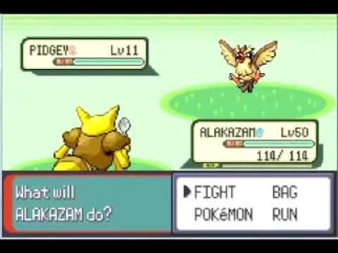

# Akemon_env

### 환경

* 1:1 Battle

* 2:2 Battle

* 3:3 Battle

* 5:5 Battle

### Observation space

* 적 HP, 상태이상(마비 같은 보이는 상태이상), 남은 포켓몬 수, 특성

* 아군 HP, 상태이상, 남은 포켓몬 수, 특성

* 아군 기술 종류, 기술 위치, 기술의 PP

* 

##### 고려사항

* 보유 기술을 바꿀 수 있는 기술(예: 메타몽의 변신)등이 있어서 기술 위치가 아닌 기술 종류를 체크해야 함

### Action Space

현재 가지고 있는 기술 4개, 교체
(아이템은 사용하지 않음)

##### 고려사항

* 포켓몬마다 쓸 수 있는 기술이 다르며, 기술 위치가 다를 수 있어서 기술 이름을 체크해야 함

* 기술을 봉인할 수 있는 기술

### Rewards

[-1,1]로

* 아군 1턴마다 : -0.1

* 아군이 포켓몬 전부 기절 시 : -1

* 적 포켓몬 전부 기절 시 : 1